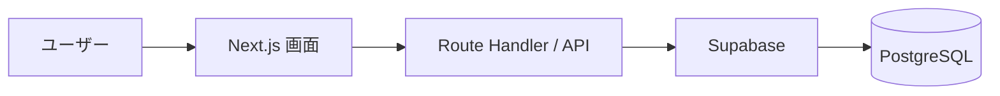

# アーキテクチャ設計

## 1. 概要

Taskuest は、タスク管理を行う Web アプリケーションである。  
本プロジェクトでは、保守性・拡張性・実務を意識した構成を目指し、Next.js をベースにフロントエンドと API を統一的に管理する。

将来的には RPG 要素や認証機能などの追加を想定しているため、初期段階から責務を分けやすい構成を採用する。

---

## 2. 採用技術

### 2.1 フロントエンド
- Next.js
- React
- TypeScript

### 2.2 バックエンド
- Next.js Route Handler
- Server Actions（必要に応じて使用を検討）

### 2.3 データベース
- Supabase
- PostgreSQL

### 2.4 スタイル
- Tailwind CSS（予定）

### 2.5 ドキュメント
- Markdown
- Mermaid

### 2.6 バージョン管理
- Git
- GitHub

---

## 3. アーキテクチャ方針

### 3.1 全体構成
本プロジェクトは、Next.js を中心とした Web アプリケーションとして構築する。  
フロントエンド、API、データアクセスを同一リポジトリ内で管理する構成とする。

### 3.2 構成方針
- UI とロジックの責務を分離する
- API 層を設け、画面から直接 DB 操作をベタ書きしすぎない
- 将来的な機能追加に備えて、コンポーネントや機能単位で整理しやすい構成にする
- ドキュメントは `docs/` 配下で管理する

---

## 4. 想定ディレクトリ構成
src/
├─ app/
│ ├─ api/
│ ├─ tasks/
│ └─ page.tsx
├─ components/
├─ features/
├─ lib/
├─ types/
└─ utils/

docs/
├─ requirements.md
├─ architecture.md
├─ db-design.md
├─ api-design.md
└─ detailed-design.md

---

## 5. データの流れ

基本的なデータの流れは以下を想定する。

1. ユーザーが画面を操作する  
2. フロントエンドから API を呼び出す  
3. API が Supabase を通じて DB にアクセスする  
4. DB の結果を API が受け取り、フロントエンドへ返却する  
5. フロントエンドが画面を再描画する  

### 5.1 イメージ図

---

## 6. API 方針
- REST 風の分かりやすい API 設計を採用する
- タスク操作に対して CRUD ベースのエンドポイントを用意する
- リクエスト、レスポンス、エラーハンドリングを意識する
- 詳細は api-design.md に記載する

## 7. データベース方針
- タスク情報は Supabase の PostgreSQL に保存する
- MVP 段階ではタスク管理に必要な最小限のテーブル構成とする
- 将来的にユーザー管理、ラベル、経験値などの拡張を考慮する
- 詳細は db-design.md に記載する

---

## 8. 設計ルール

### 8.1 命名
- コンポーネント名は PascalCase とする
- 関数名、変数名は camelCase とする
- DB カラム名は snake_case を基本とする
- ファイル名は役割が分かる名前にする

### 8.2 コンポーネント分割
- 表示だけを担う UI コンポーネントと、状態や処理を持つ部分を分ける
- 大きくなりすぎるコンポーネントは分割する

### 8.3 型定義
- API 入出力、DB レコード、フォーム入力値は型を定義する
- any は極力使わない

### 8.4 ドキュメント
- 要件、設計、DB、API 仕様は Markdown で管理する
- 図が必要な場合は Mermaid を利用する

---

## 9. 今後の拡張を見据えた方針
- 認証機能の追加
- ユーザー単位のタスク管理
- ラベル / タグ機能
- ドラッグ＆ドロップによる並び替え
- RPG 要素の追加
- 協力タスク機能の追加