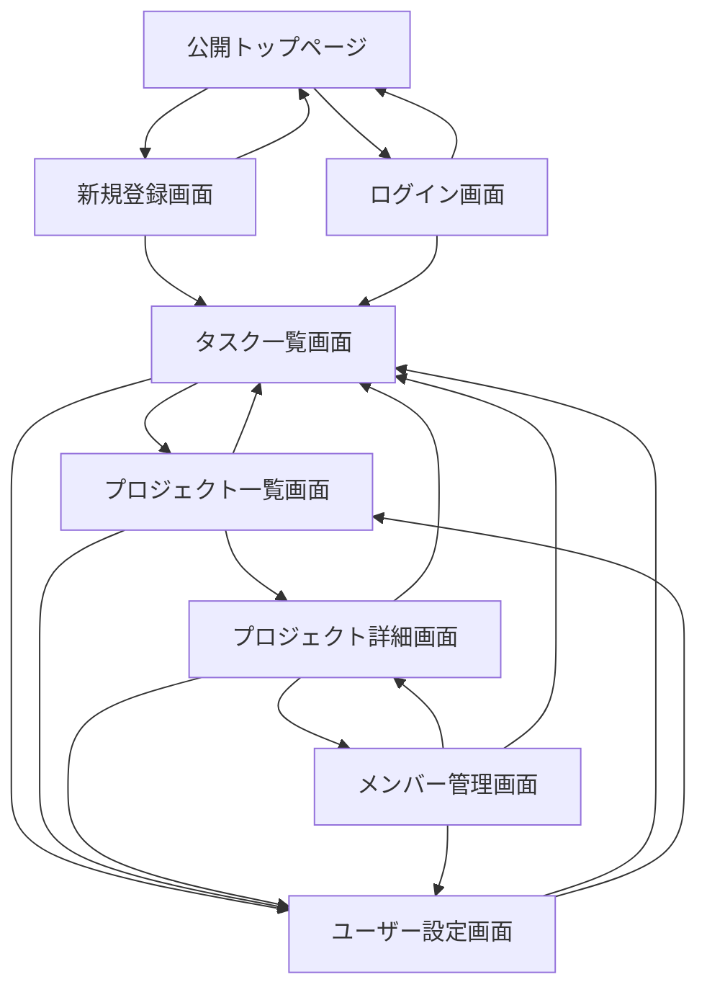

# 基本設計
---
## 1. システム構成
Taskuest v1 は、フロントエンドに Next.js、バックエンド基盤に Supabase を採用する。  
認証は Supabase Auth、データベースは PostgreSQL を利用する。

### 1.1 使用技術
- フロントエンド: Next.js / TypeScript
- スタイリング: Tailwind CSS
- バックエンド基盤: Supabase
- 認証: Supabase Auth
- データベース: PostgreSQL
- ホスティング: Vercel

### 1.2 構成概要
- ユーザーはブラウザからアプリへアクセスする
- フロントエンドは Next.js で構築する
- 認証は Supabase Auth を利用する
- タスク、プロジェクト、ユーザー情報は Supabase PostgreSQL に保存する
- データアクセス制御は RLS により実施する

### 1.3 構築方針
- 認証と業務データを分離する
- DBアクセス制御は RLS を利用する
- 個人タスクとプロジェクトタスクを同一テーブルで管理する
- v1ではシンプルな構成を優先する

---

## 2. 共通レイアウト
### 2.1 未認証レイアウト
#### 構成
- 上部にシンプルヘッダーを表示
- メイン領域に各画面のコンテンツを表示

#### ヘッダー
- ロゴを表示
- ログイン画面への遷移
- 新規登録画面への遷移

#### 特徴
- ユーザーサムネイルは表示しない
- 認証前ユーザー向けのシンプルな構成とする

### 2.2 認証後共通レイアウト
#### 構成
- 上部に共通ヘッダーを表示
- 左側にアコーディオンメニューを表示
- メイン領域に各画面の内容を表示

#### 共通ヘッダー
- 右上にユーザーサムネイルを表示
- サムネイル押下でユーザーメニューを表示
- ユーザーメニュー内に以下を表示
  - 表示名
  - レベル
  - ログアウトボタン
  - ログアウト後に公開トップページへ遷移

#### 左側メニュー
- 左の展開ボタンで開閉可能
- タスク一覧画面への遷移
- プロジェクト一覧画面への遷移

---

## 3. 画面一覧
### 3.1 公開トップページ
#### レイアウト
- 未認証レイアウトを使用

#### 機能
- アプリの概要説明
- 新規登録画面への画面遷移
- ログイン画面への画面遷移

#### 遷移
- 新規登録画面
- ログイン画面

### 3.2 新規登録画面
#### レイアウト
- 未認証レイアウトを使用

#### 機能
- アプリへのユーザー登録

#### 遷移
- タスク一覧画面（新規登録成功時）
- 公開トップページ（キャンセル時）

### 3.3 ログイン画面
#### レイアウト
- 未認証レイアウトを使用

#### 機能
- ログイン認証

#### 遷移
- タスク一覧画面（ログイン成功時）
- 公開トップページ（キャンセル時）

### 3.4 タスク一覧画面
#### レイアウト
- 認証後共通レイアウトを使用

#### 機能
- タスク一覧表示
- タスク追加（モーダル）
- タスク編集（モーダル）
- タスクのアーカイブ
- タスクの完了

#### 遷移
- 画面固有の遷移なし
- 共通レイアウトのメニューから他画面へ遷移可能

### 3.5 プロジェクト一覧画面
#### レイアウト
- 認証後共通レイアウトを使用

#### 機能
- 所属プロジェクト一覧の表示
- プロジェクト作成

#### 遷移
- プロジェクト詳細画面

### 3.6 プロジェクト詳細画面
#### レイアウト
- 認証後共通レイアウトを使用

#### 機能
- プロジェクト一覧で選択したプロジェクトの表示
- プロジェクトメンバーの表示
- プロジェクトに設定されているタスクの一覧表示
- プロジェクトタスクの追加（モーダル）
- プロジェクトタスクの編集（モーダル）
- プロジェクトのオーナーのみ、プロジェクトメンバー管理画面へ遷移できる

#### 遷移
- プロジェクトメンバー管理画面

### 3.7 メンバー管理画面
#### レイアウト
- 認証後共通レイアウトを使用

#### 機能
- プロジェクトメンバーの追加・削除
- owner または admin 権限ユーザーのみ操作可能

#### 遷移
- プロジェクト詳細画面

### 3.8 ユーザー設定画面
#### レイアウト
- 認証後共通レイアウトを使用

#### 機能
- ユーザー基本情報の確認
  - ユーザー名
  - ユーザーID
  - メールアドレス
- パスワード再設定誘導への導線

#### 遷移
- 画面固有の遷移なし
- 共通レイアウトのメニューから他画面へ遷移可能

## 4. 画面遷移
