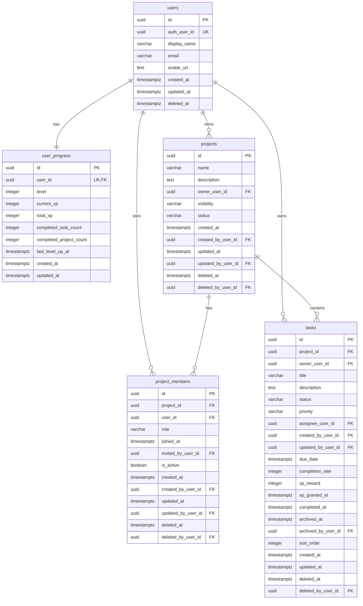

# ER Diagram

## 概要

Taskuest v1 のデータベース ER 図。  
以下の 5 テーブルで構成する。

- `users`
- `user_progress`
- `projects`
- `project_members`
- `tasks`

---

## Mermaid ER Diagram

---

## 関係の補足

### users と user_progress
- 1ユーザーにつき 1つの成長情報を持つ
- 1 : 1 の関係

### users と projects
- 1ユーザーが複数プロジェクトを所有できる
- 1 : N の関係

### users と project_members
- 1ユーザーが複数プロジェクトに所属できる
- 1 : N の関係

### projects と project_members
- 1プロジェクトに複数メンバーが所属できる
- 1 : N の関係

### projects と tasks
- 1プロジェクトに複数タスクを持てる
- 1 : N の関係
- ただし個人タスクは `project_id IS NULL`

### users と tasks
- 1ユーザーが複数タスクを所有できる
- 1 : N の関係

---

## 補足事項

### 個人タスクについて
個人タスクは `tasks.project_id IS NULL` で表現する。  
そのため ER 図上では `projects` と `tasks` の関係が必須に見えても、実際の実装では NULL を許可する。

### project_members について
`project_members` は `users` と `projects` の多対多関係を解消するための中間テーブルである。  
また、所属だけでなくロール管理も担う。

### tasks について
`tasks` は Taskuest の中心テーブルであり、以下を一括管理する。

- 個人タスク / プロジェクトタスク
- 進捗
- 優先度
- 担当者
- 経験値
- アーカイブ
- 論理削除

---

## まとめ

- `project_members` によってユーザーとプロジェクトの多対多関係を表現する
- `tasks` は個人タスクとプロジェクトタスクを統一管理する
- `user_progress` によってユーザー成長要素を分離している
- v1 としてはシンプルさと拡張性のバランスを重視した構成である